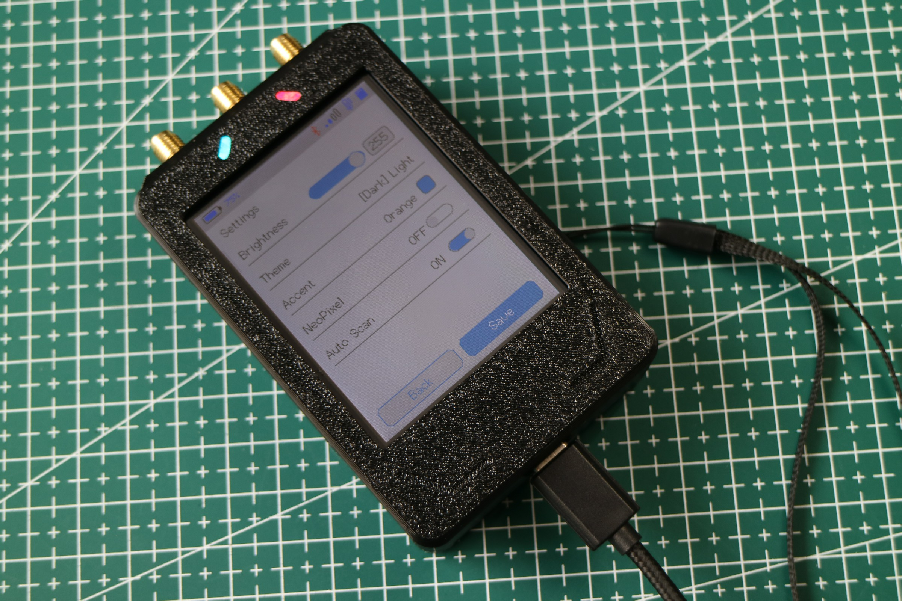
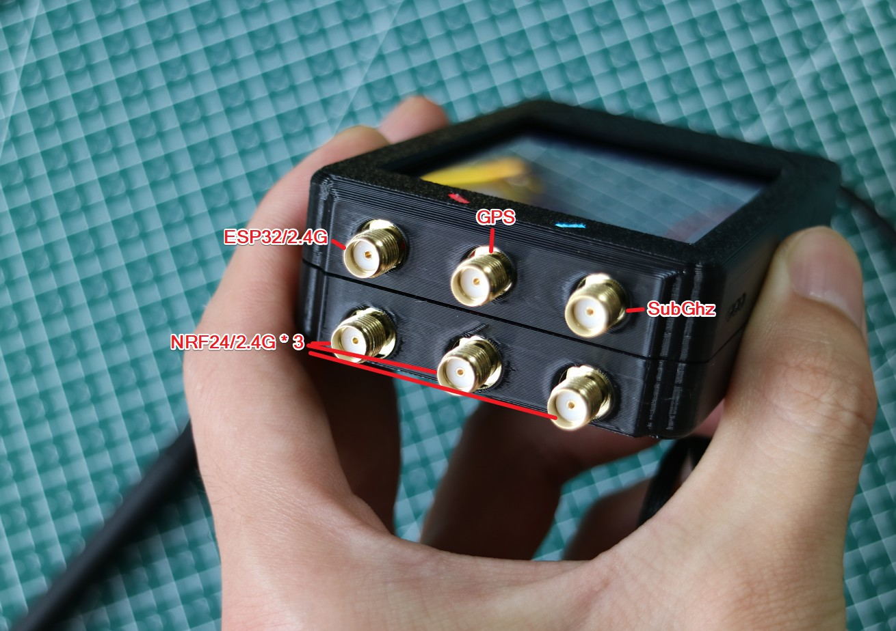

# 
KUMA-DIV

Welcome, and thank you for your support! This is the public repository for the KUMA-DIV project.

****Project Origin****

The KUMA-DIV project is based on https://github.com/cifertech/ESP32-DIV, with the following major differences:

1. KUMA-DIV completely redefines the hardware connections, fixes several pin conflicts, and redesigns the entire PCB.

2. The design makes full use of the touchscreen, eliminating most physical buttons and significantly reducing the overall size.

3. An RGB indicator LED and a buzzer have been reintroduced.

> [!IMPORTANT]

> Disclaimer: This device is intended for lawful technical research, learning, and analysis/testing by qualified users only. (You should know what you're doing.)

****Getting Started****

There is a button on the right side of the device. Press it once briefly to power the device on, or press it twice briefly to power it off.

There are two indicator LEDs on the top of the device. The one on the left is a software-controllable RGB LED, while the one on the right is the charging indicator (red while charging, off when fully charged).

There is a Type-C port on the bottom of the device, which can be used for charging and debugging. It features an integrated CH340 USB-to-serial chip and an automatic ESP32 programming circuit.

There are six antenna ports on the top of the device. Here is what each port is used for. You can refer to the image below when installing the antennas.

****Project Files****

[Shell_Modell](./Shell_Model)

The enclosure model files are currently available. You can now 3D-print your own enclosure and make it more stylish ⭐ and more personalized 😎!

[Software](./Software)

The source code is now available. You can build the project yourself, and a detailed compilation guide is also included in the directory 🔨!

****Contact Me****

This is my Tindie store:

[Tindie]https://www.tindie.com/stores/wensley/

If you are interested in collaboration or have suggestions regarding the project, feel free to contact me by email:

[Email]xiao_hei666@yeah.net
