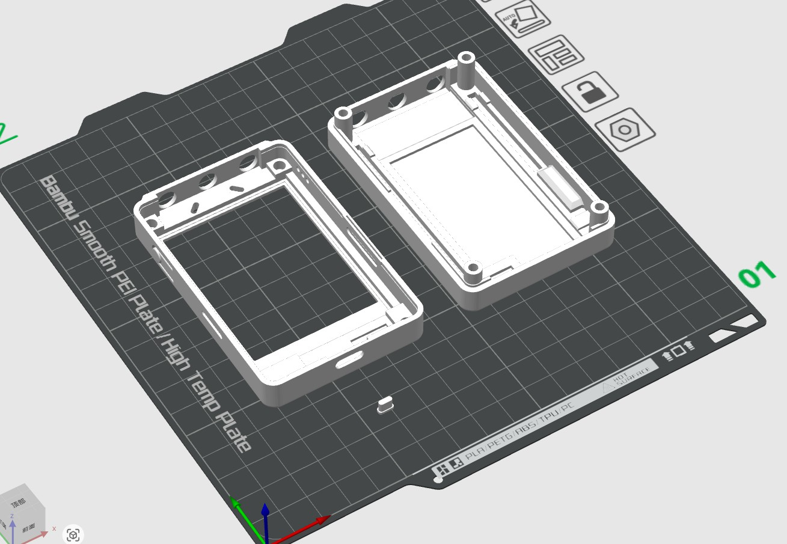
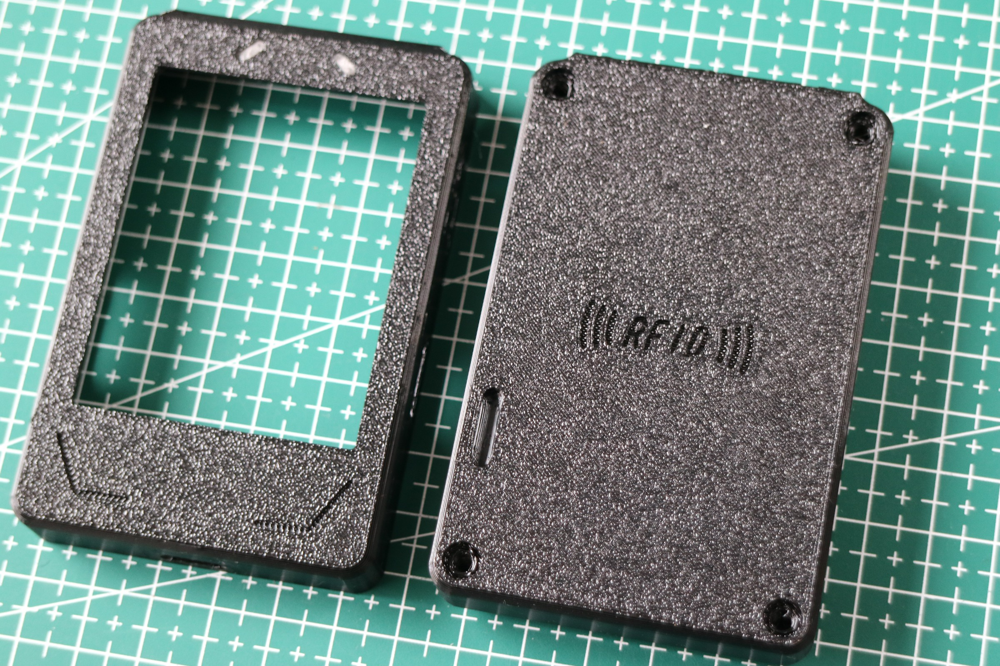
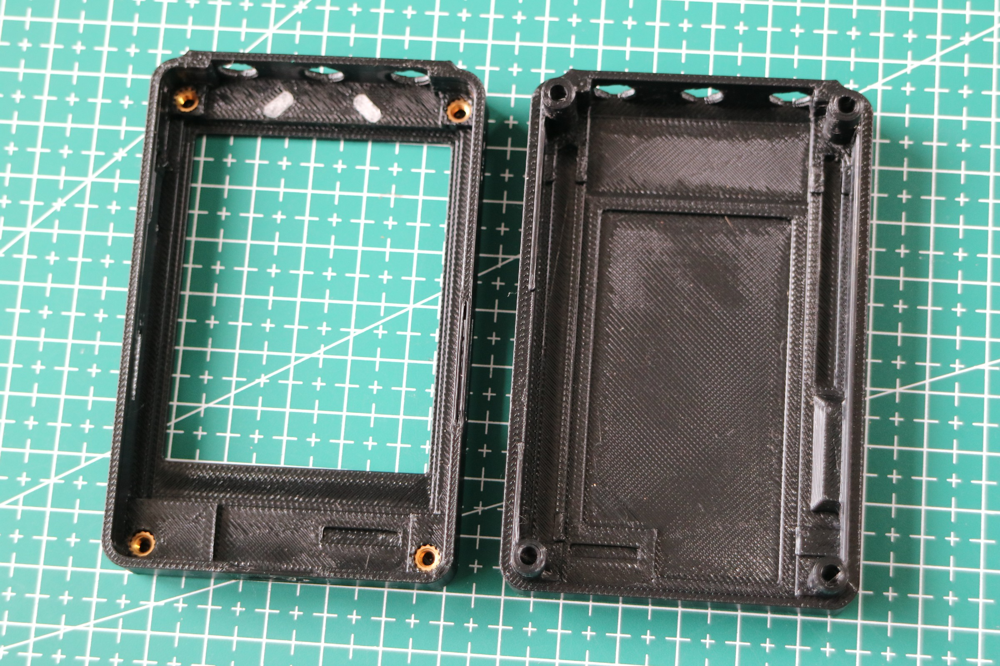
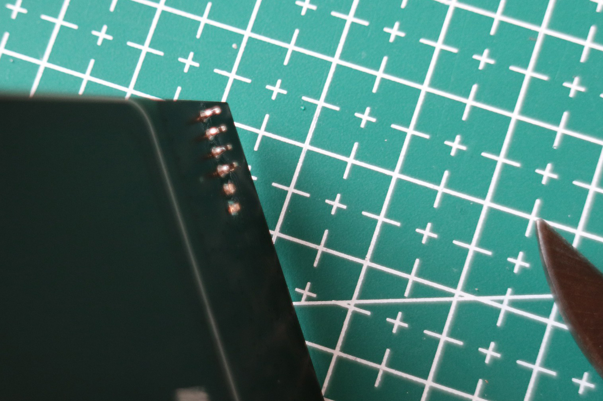
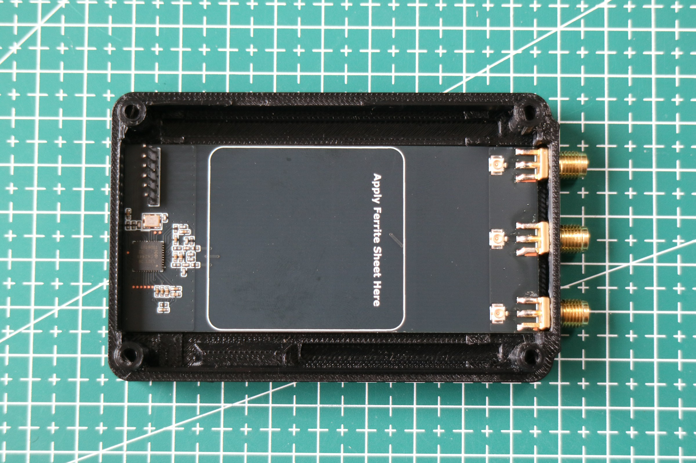
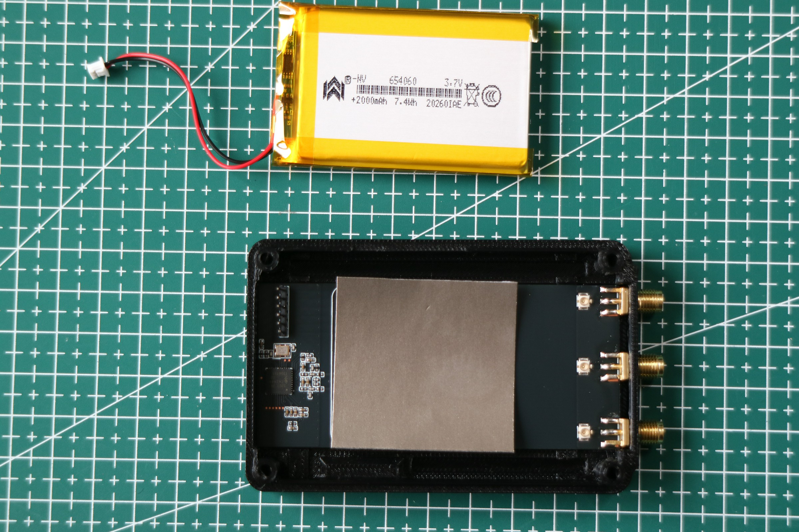
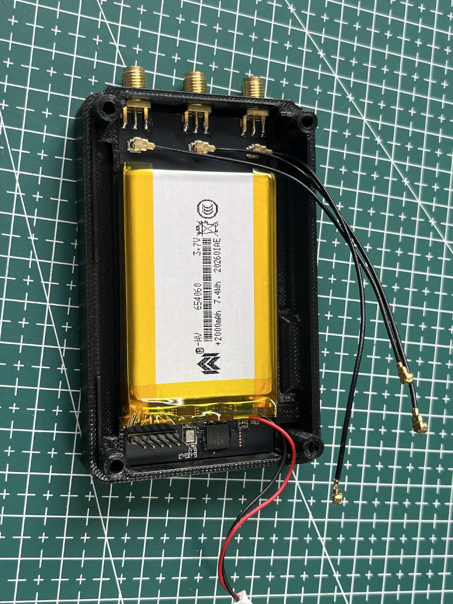
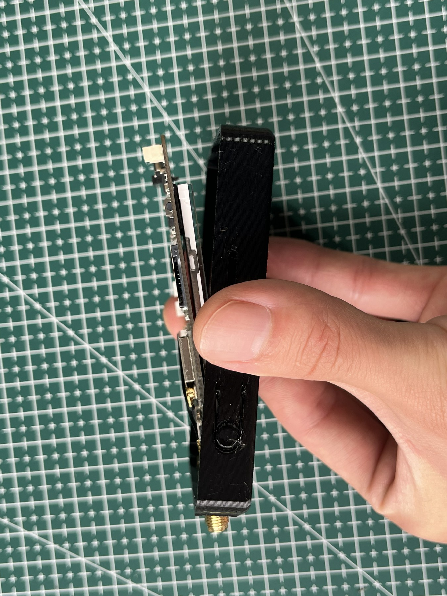
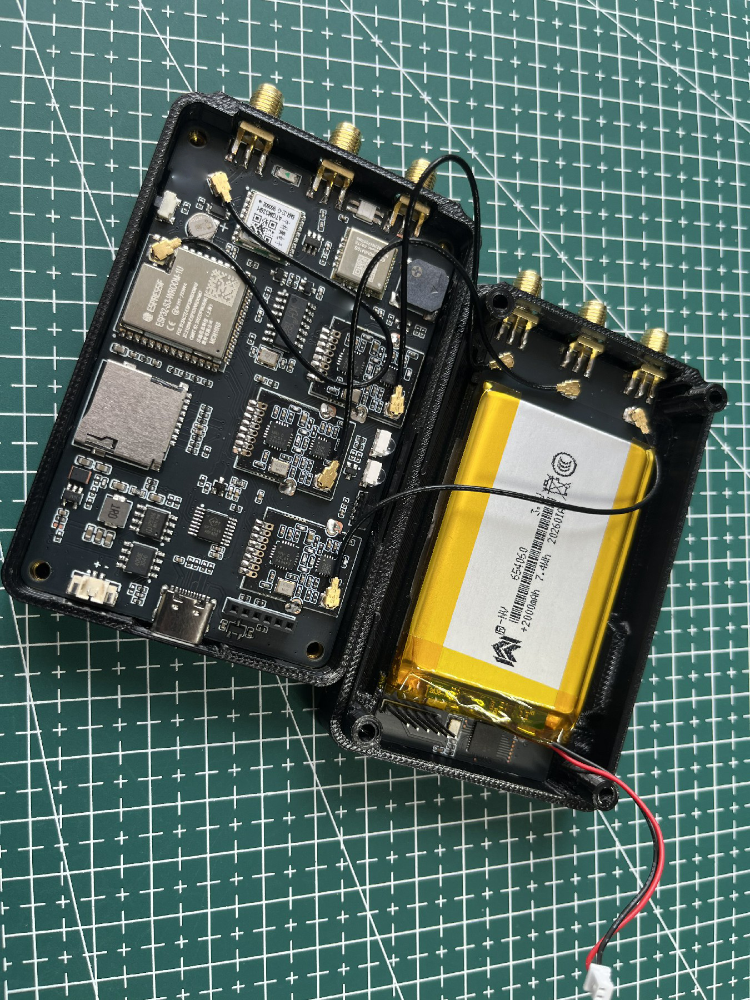
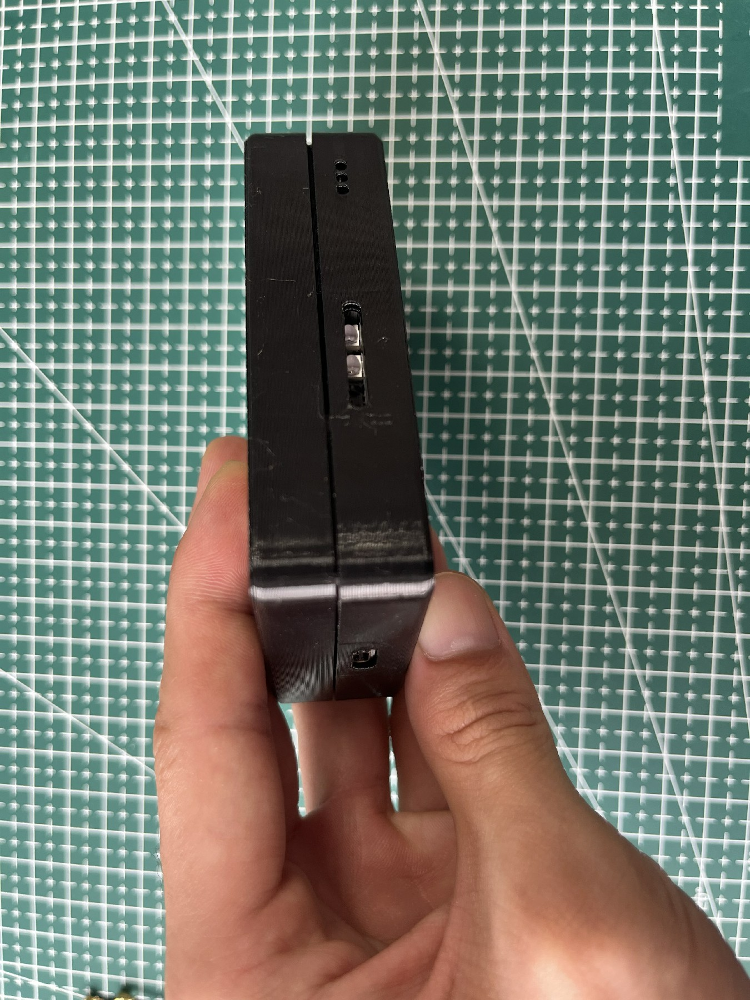

Welcome, and thank you for your support! If you have a 3D printer, you can now print your own enclosure and make it more stylish ⭐ and more personalized 😎! If you have enough time, you can also choose a finer print resolution for a more detailed result.

Next, I will explain how to assemble the enclosure. If you live in a hot climate, or if the device may be exposed to direct sunlight or high temperatures, PETG or another higher-temperature filament is recommended.

**### Before You Start Printing Your Own Enclosure:**

1. Replacing and installing the enclosure requires some hands-on skills. Any consequences caused by improper operation are your own responsibility. However, since you already have the ability to operate a 3D printer, I believe you can handle it.

2. Make sure the print bed of your 3D printer is clean and has good adhesion, as printing narrow lines and small characters places higher demands on the print bed.

**### File Description:**

This directory contains 2 main enclosure parts: the top shell, the bottom shell, and the light guides.

The light guides must be printed using transparent material.

**### Disassembly and Assembly Instructions:**

> [!TIP]
> Before disassembly, you can touch a nearby grounded metal object or use an anti-static wrist strap to prevent electrostatic discharge from damaging the circuit board.

****1. Installing the Light Guides and Heat-Set Nuts****

Use a hammer to gently tap the light guides into the holes, making sure the front surface is flush with the enclosure. Then heat the nuts and press them into the corresponding holes. The final result should look like the pictures below:

****2. Installing the RFID/NFC Module****

Before installation, you need to cut off the protruding header pins shown in the picture. As shown below, I removed two of them so you can see the difference in height.

First, insert the antenna connector through the hole, then press the circuit board into the position shown in the picture. There are four clips around the circuit board. Press firmly to make sure the board is securely locked in place.

Attach the magnetic shielding sticker to the area inside the white rectangle. (The size may vary slightly; just make sure it covers the white border.) Then use double-sided tape to secure the battery to the magnetic shielding material.

Finally, connect the antenna extension cable to the position shown in the picture.

****3. Installing the Main Board****

When installing the main board, first insert the antenna connector through the hole, then press the board into place. Make sure that the screen is properly aligned with the enclosure. Do not use excessive force, as this may damage the screen.

Connect the extension coil cable to the main board.

You can choose to ignore the infrared area on the side, or install a piece of transparent material over it for dust protection. Finally, install the screws, and you're done!

